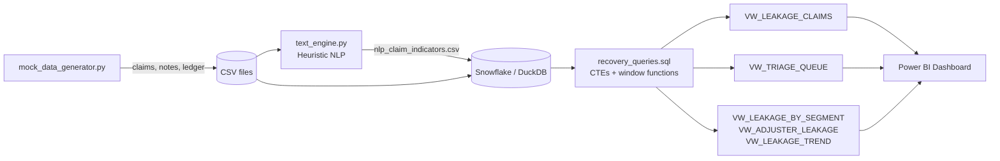

# Commercial P&C Insurance: Automated Subrogation Engine & Leakage Analyzer


> **Note:** All data in this project is synthetic, generated with Python and Faker. No real insureds, claims, or carriers are represented. Financial results describe the synthetic portfolio only.

---

## 🏢 Business Context & Problem Statement

In Commercial Property & Casualty (P&C) insurance, high adjuster caseloads frequently result in missed **subrogation opportunities**: cases where a third party (a negligent subcontractor, a faulty equipment manufacturer, another driver) was legally at fault for a loss. When an insurer pays a claim without pursuing recovery from the responsible party, the result is **claims leakage**, which directly worsens the carrier's loss ratio and combined ratio.

The evidence is usually already in the file. It sits in free-text adjuster diary notes ("rear-ended while stopped at a light", "defective valve on the sprinkler riser") that nobody reads again once the claim is closed.

**Project objective:** Build an end-to-end analytical pipeline that scans unstructured adjuster diaries, isolates third-party liability indicators, quantifies financial leakage, and produces a prioritized triage queue for the subrogation unit.

---

## 📈 Results (synthetic 50,000-claim portfolio)

| Metric | Value |
|---|---|
| Claims analyzed | 50,000 (Commercial Auto, Property, GL, Inland Marine) |
| Adjuster notes scanned | ~220,000 |
| Closed claims with missed subrogation | **1,204** |
| Estimated leakage (modeled) | **$8.7M** |
| Portion still inside the statute of limitations | **$4.5M** (candidates to reopen) |
| Open claims in triage queue | 301 of 4,577 open files (**6.6%** of inventory) |
| Estimated recovery value in open queue | $2.2M |

**NLP engine accuracy** (scored against the generator's hidden ground truth, threshold = 60):

| Precision | Recall |
|---|---|
| 96.2% | 83.1% |

**Triage tier validation** (share of queued claims with genuine recovery potential):

| Tier | Claims | True-positive rate |
|---|---|---|
| P1 – Pursue Now | 61 | 97% |
| P2 – Review This Week | 202 | 88% |
| P3 – Monitor | 38 | 34% |

### Key insights

1. **Contractor/vendor negligence on commercial property** is the largest leakage driver (21% of estimated leakage), followed by **Commercial Auto rear-end collisions** (19%) and **defective equipment** on property losses (18%).
2. **Roughly half of the leaked dollars are still recoverable.** Those files closed recently enough that the statute of limitations has not expired, so a reopen-and-pursue campaign is possible.
3. **Precision drops sharply on the "not referred" population.** Across all claims the engine is 96% precise, but among closed files an adjuster chose *not* to refer, it falls to about 64%. Adjusters correctly passed on many ambiguous files, so leakage estimates should be treated as an upper bound and sampled by a human before a campaign.
4. **Missed referrals cluster by adjuster.** `VW_ADJUSTER_LEAKAGE` shows a small group of adjusters with materially higher missed-referral rates, which points to caseload or training issues rather than a portfolio-wide gap.

> Figures are reproducible: run the pipeline with the default seed (`42`) and you will get the same numbers.

---

## 🛠️ Tech Stack

| Layer | Tools |
|---|---|
| Data generation & processing | Python 3.11+, Pandas, NumPy, Faker |
| Text mining | Python `re` (heuristic NLP with sentence-scoped negation) |
| Data warehouse | Snowflake SQL (Databricks-compatible notes included) |
| Local execution | DuckDB (runs the same SQL without a cloud account) |
| Business intelligence | Power BI (DAX, Power Query) |
| Quality | pytest, GitHub Actions CI |

---

## 📊 Pipeline Architecture



### 1. Data model

| Table | Grain | Description |
|---|---|---|
| `CLAIMS_MASTER` | 1 row per claim | LOB, loss cause, state, dates, status, adjuster, `SUBROGATION_FLAG` |
| `ADJUSTER_NOTES` | 1 row per diary note | Free-text adjuster notes (FNOL, investigation, closure) |
| `FINANCIAL_RESERVES` | 1 row per transaction | Reserve changes, indemnity and expense payments, recoveries |
| `NLP_CLAIM_INDICATORS` | 1 row per claim | Output of the text engine: score, category, matched phrases |
| `REF_STATE_SOL` | 1 row per state | Illustrative statute-of-limitations years |
| `REF_RECOVERY_RATES` | 1 row per category | Modeled expected recovery rate |
| `REF_RUN_CONFIG` | single row | As-of date and thresholds used by every view |

### 2. Heuristic NLP text engine (`src/text_engine.py`)

- Splits each note into sentences.
- Discards any sentence containing a **negation or insured-at-fault pattern**, such as *"insured driver rear-ended the claimant"*, *"no evidence of defect"*, or *"ruled out"*. This prevents the most common false positive in keyword-based subrogation screening.
- Matches remaining sentences against a **weighted regex dictionary** across six categories: rear-end, third-party auto fault, product defect, contractor negligence, utility/adjacent party, and carrier liability.
- Rolls up to claim level with a 0–100 `INDICATOR_SCORE` (strongest hit, plus bonuses for corroborating notes and multiple categories).

The generator deliberately includes liability language the dictionary does **not** cover, and liability-sounding notes on files with no real recovery potential, so the accuracy figures reflect a realistic trade-off rather than a perfect match.

### 3. Leakage quantification (`sql/recovery_queries.sql`)

A claim counts as leakage when it is **closed**, `SUBROGATION_FLAG = 'No'`, has **no recovery**, has `INDICATOR_SCORE >= 60`, and net paid indemnity is at least $1,000.

```
Estimated leakage = Net paid indemnity × Expected recovery rate (category) × (Indicator score / 100)
```

SQL techniques used include multi-step CTEs, running totals (`SUM() OVER`), `QUALIFY ROW_NUMBER()` for latest-record selection, `RANK` / `DENSE_RANK` / `PERCENT_RANK`, share-of-total windows over grouped results, and rolling 3-month averages.

### 4. Triage scoring engine (`VW_TRIAGE_QUEUE`)

Open, unreferred claims with an indicator and an unexpired statute of limitations are scored 0–100:

| Component | Max points | Logic |
|---|---|---|
| Indicator strength | 45 | `INDICATOR_SCORE × 0.45` |
| Recovery rate | 15 | Category expected recovery × 20 |
| Financial exposure | 25 | Log-scaled total incurred, capped at $250K |
| SOL urgency | 15 | ≤180 days = 15, ≤365 = 10, ≤730 = 6, else 3 |
| Mixed signals | −10 | Negation language also present in the diary |

Tiers: **P1** ≥ 75, **P2** 60–74, **P3** < 60. Each claim also gets a unit-wide `QUEUE_RANK` and a per-adjuster `ADJUSTER_QUEUE_POSITION`.

---

## 📁 Repository Structure

```
subrogation-leakage-analyzer/
├── README.md
├── requirements.txt
├── LICENSE
├── .gitignore
├── .github/workflows/ci.yml        # Runs the full pipeline + tests on every push
├── data/
│   ├── mock_data_generator.py      # Synthetic portfolio generator
│   └── output/                     # Generated CSVs (git-ignored)
├── src/
│   └── text_engine.py              # Heuristic NLP engine
├── notebooks/
│   └── text_mining_engine.ipynb    # Walkthrough + accuracy evaluation
├── sql/
│   └── recovery_queries.sql        # Snowflake DDL, load, analytics views
├── scripts/
│   └── run_pipeline_local.py       # Runs the SQL locally in DuckDB, exports Power BI extracts
├── dashboard/
│   ├── POWER_BI_GUIDE.md           # Data model, DAX measures, page layout
│   └── screenshots/
└── tests/
    └── test_text_engine.py
```

---

## 🚀 How to Run

### Option A: Local (no cloud account needed)

```bash
git clone https://github.com/<your-username>/subrogation-leakage-analyzer.git
cd subrogation-leakage-analyzer
pip install -r requirements.txt

python data/mock_data_generator.py      # 1. Generate 50,000 synthetic claims
python src/text_engine.py               # 2. Scan adjuster notes for liability indicators
python scripts/run_pipeline_local.py    # 3. Run the SQL analytics in DuckDB + export for Power BI
pytest -q                               # 4. Optional: run unit tests
```

Step 3 prints the headline metrics and writes Power BI-ready extracts to `data/output/powerbi/`.

### Option B: Snowflake

1. Run steps 1 and 2 above to produce the CSVs.
2. Upload them to a stage: `PUT file://data/output/*.csv @STG_SUBRO AUTO_COMPRESS=TRUE;`
3. Execute `sql/recovery_queries.sql` top to bottom.

### Notebook

Open `notebooks/text_mining_engine.ipynb` for a walkthrough of the NLP layer, including example matches, negation handling, and precision/recall against ground truth.

### Power BI

Connect Power BI Desktop to the CSVs in `data/output/powerbi/` (or directly to the Snowflake views) and follow `dashboard/POWER_BI_GUIDE.md` for the data model and DAX measures.

---

## ⚠️ Assumptions & Limitations

- **Synthetic data.** Loss causes, severities, liability probabilities, and missed-referral rates are modeling assumptions chosen to be plausible, not calibrated to any carrier's experience.
- **Statute-of-limitations table is illustrative.** Real subrogation SOL varies by state, cause of action, and contract terms. Confirm with counsel before operational use.
- **Expected recovery rates are assumptions.** In production they would come from the carrier's own subrogation recovery history.
- **Heuristic NLP.** Regex dictionaries are transparent and auditable but miss novel phrasing. A natural next step is a supervised classifier (e.g., TF-IDF + logistic regression or a fine-tuned transformer) trained on historical referral outcomes.
- **Leakage is an estimate.** It represents expected value, not guaranteed recovery, and excludes pursuit costs such as legal fees and arbitration.

---

## 🔭 Future Enhancements

- Replace the regex dictionary with an ML classifier and compare lift against the heuristic baseline.
- Add pursuit-cost netting so the queue ranks on expected *net* recovery.
- Schedule the pipeline (Snowflake Tasks or Databricks Workflows) to refresh the triage queue daily.
- Write the triage queue back to the claims system as an adjuster work item.

---

## 📄 License

Released under the [MIT License](LICENSE).
